# devxisas/qr-studio

[](https://packagist.org/packages/devxisas/qr-studio)
[](https://github.com/devxisas/qr-studio/actions?query=workflow%3Arun-tests+branch%3Amain)
[](https://packagist.org/packages/devxisas/qr-studio)
[](LICENSE)

A modern QR code studio for Laravel. Inspired by and built upon the foundation of [simplesoftwareio/simple-qrcode](https://github.com/SimpleSoftwareIO/simple-qrcode), this package brings full PHP 8.2+ type safety, enum-based APIs, new data types (vCard, MeCard, Calendar Events), a Blade directive, a response macro, a `toDataUri()` helper, an Artisan command, and the `HasQrCode` Eloquent trait — while keeping the same familiar fluent interface.

> [!NOTE]
> **Migrating from `simplesoftwareio/simple-qrcode`?** See the [migration guide](#migrating-from-simplesoftwareiosimple-qrcode) at the bottom of this page.

---

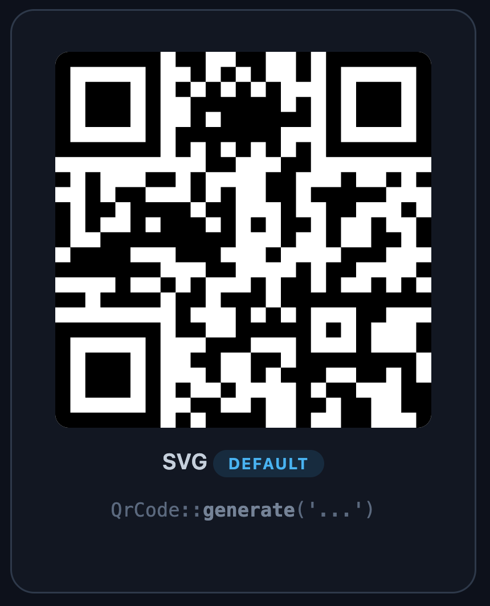

---

## Requirements

| Package version | Laravel | PHP   |
|-----------------|---------|-------|
| 1.x             | 11, 12  | 8.2+  |

## Installation

```bash
composer require devxisas/qr-studio
```

The service provider is registered automatically via Laravel's package auto-discovery.

PNG generation uses `ext-imagick` when available, and falls back to `ext-gd` (installed by default on most servers) when Imagick is not installed. Note: the GD fallback does not support gradients.

To install Imagick for best PNG quality:

```bash
composer require ext-imagick
```

---

## Basic Usage

Use the `QrCode` facade anywhere in your application:

```php
use Devxisas\QrStudio\Facades\QrCode;

// Generate an SVG (default) — safe to render directly in Blade with {!! !!}
$svg = QrCode::generate('https://devxi.com');

// Save to a file
QrCode::generate('https://devxi.com', '/path/to/qrcode.svg');
```

In a Blade template:

```blade
{!! QrCode::size(200)->generate('https://devxi.com') !!}
```


---

## Configuration

Publish the config file to set package-wide defaults:

```bash
php artisan vendor:publish --tag="qr-studio-config"
```

This creates `config/qr-studio.php`:

```php
use Devxisas\QrStudio\Enums\ErrorCorrection;
use Devxisas\QrStudio\Enums\Format;

return [
    'format'           => Format::Svg,           // Format enum or 'svg' | 'eps' | 'png'
    'size'             => 100,                    // pixels
    'margin'           => 0,                      // quiet zone around the code
    'error_correction' => ErrorCorrection::Medium, // enum or 'L' | 'M' | 'Q' | 'H'
    'encoding'         => 'UTF-8',               // character encoding
];
```

These defaults are applied to every QR code generated through the `QrCode` facade, the `@qrcode` Blade directive, and the `response()->qrcode()` macro. Per-call options always take precedence over config defaults.

> **Scope of defaults:** `format`, `size`, `margin`, `error_correction`, and `encoding` can be set globally. Options like `style`, `eye`, `color`, and `gradient` are always set per call since they are visual choices that vary per use case.

---

## Formats

Three output formats are supported. You can pass a string or the `Format` enum.

```php
use Devxisas\QrStudio\Enums\Format;

QrCode::generate('...');                          // SVG (default)
QrCode::format('png')->generate('...');           // PNG
QrCode::format(Format::Png)->generate('...');     // PNG via enum
QrCode::format('eps')->generate('...');           // EPS (vector, no browser preview)
```

> **PNG and the GD fallback:** PNG generation uses `ext-imagick` when available. When Imagick is not installed the package falls back to `ext-gd`. The GD fallback works for most use cases, but gradients are not supported under GD — use Imagick if you need gradient PNGs.

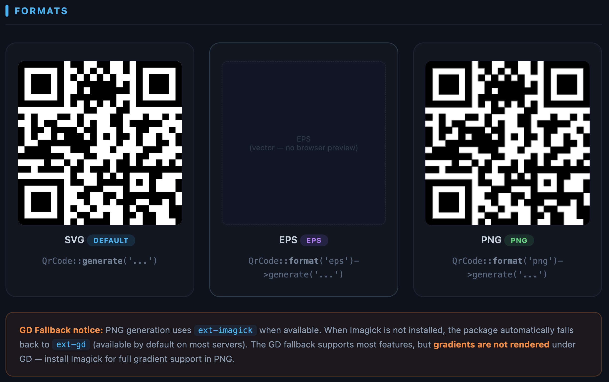

---

## Size & Margin

```php
QrCode::size(300)->generate('...');
QrCode::size(300)->margin(4)->generate('...');
```

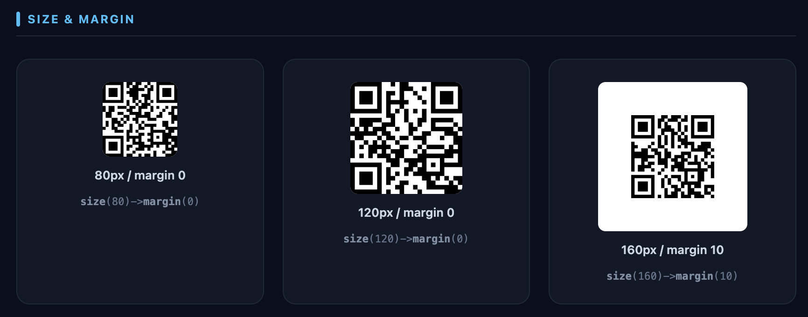

---

## Error Correction

Higher levels allow the QR code to be read even when partially obscured (e.g. with a logo overlay).

```php
use Devxisas\QrStudio\Enums\ErrorCorrection;

QrCode::errorCorrection('H')->generate('...');
QrCode::errorCorrection(ErrorCorrection::High)->generate('...');
```

| Level | Enum                        | Data recovery |
|-------|-----------------------------|---------------|
| `L`   | `ErrorCorrection::Low`      | 7%            |
| `M`   | `ErrorCorrection::Medium`   | 15% (default) |
| `Q`   | `ErrorCorrection::Quartile` | 25%           |
| `H`   | `ErrorCorrection::High`     | 30%           |

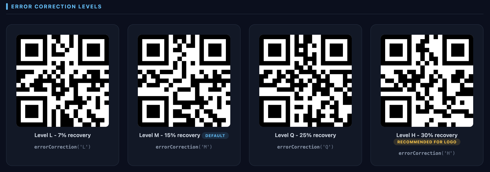

---

## Module Styles

```php
use Devxisas\QrStudio\Enums\Style;

QrCode::style('square')->generate('...');          // default
QrCode::style('dot', 0.5)->generate('...');
QrCode::style('round', 0.7)->generate('...');

// Enum API
QrCode::style(Style::Dot, 0.5)->generate('...');
```

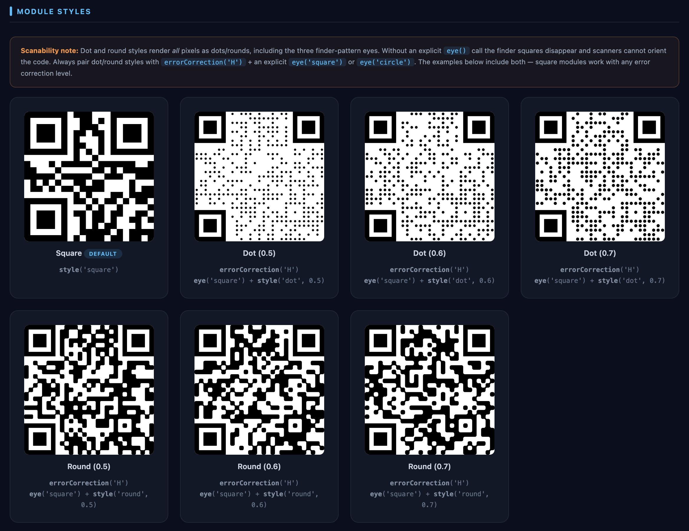

---

## Eye Styles

```php
use Devxisas\QrStudio\Enums\EyeStyle;

QrCode::eye('square')->generate('...');   // default
QrCode::eye('circle')->generate('...');
QrCode::eye('pointy')->generate('...');   // new in BaconQrCode 3.x — curved outer + circle inner

// Enum API
QrCode::eye(EyeStyle::Circle)->generate('...');
QrCode::eye(EyeStyle::Pointy)->generate('...');
```

| Value      | Enum               | Description                                      |
|------------|--------------------|--------------------------------------------------|
| `square`   | `EyeStyle::Square` | Default square finder eye                        |
| `circle`   | `EyeStyle::Circle` | Circular finder eye                              |
| `pointy`   | `EyeStyle::Pointy` | Curved outer corner + circle inner (BaconQrCode 3.x) |

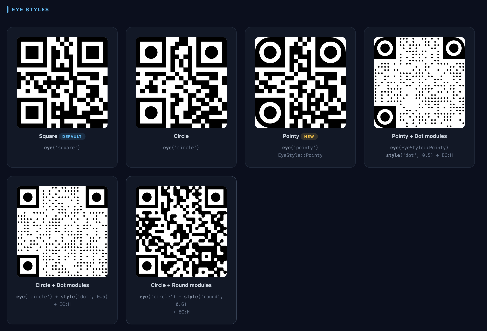

---

## Colors

### Foreground & background

```php
QrCode::color(59, 130, 246)->generate('...');
QrCode::color(255, 255, 255)->backgroundColor(15, 23, 42)->generate('...');

// With alpha (0–127, where 127 = fully transparent)
QrCode::color(59, 130, 246, 50)->generate('...');
```

### Per-eye colors

Each of the three finder eyes (0, 1, 2) can have independent inner and outer colors.

```php
QrCode::eyeColor(0, 239, 68, 68)           // eye 0 — red (inner = outer)
      ->eyeColor(1, 34, 197, 94)           // eye 1 — green
      ->eyeColor(2, 59, 130, 246)          // eye 2 — blue
      ->generate('...');

// With separate inner and outer colors
// eyeColor(eye, innerR, innerG, innerB, outerR, outerG, outerB)
QrCode::eyeColor(0, 255, 255, 255, 59, 130, 246)->generate('...');
```

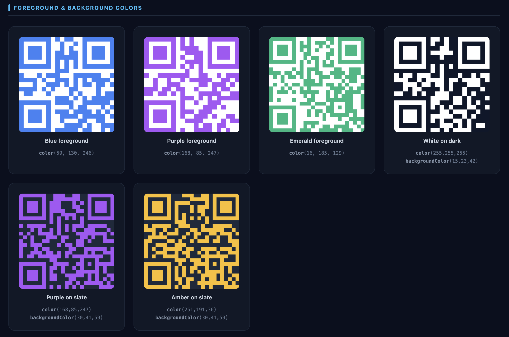

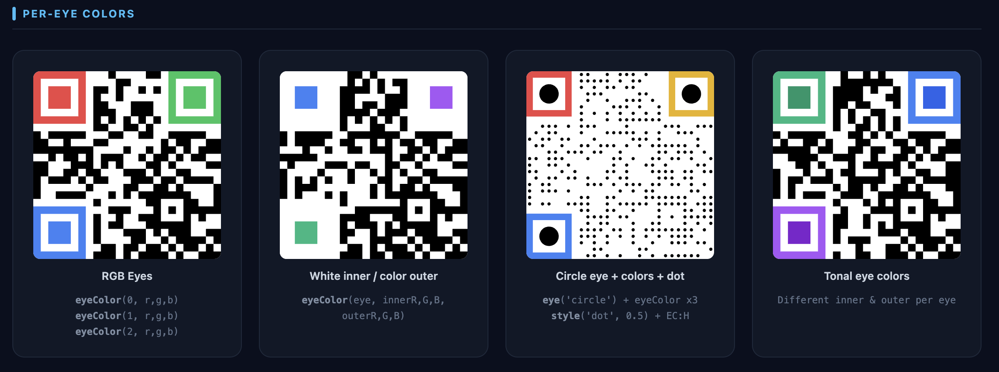

---

## Gradients

```php
use Devxisas\QrStudio\Enums\GradientType;

// gradient(startR, startG, startB, endR, endG, endB, type)
QrCode::gradient(59, 130, 246, 168, 85, 247, 'radial')->generate('...');

// Enum API
QrCode::gradient(59, 130, 246, 168, 85, 247, GradientType::Radial)->generate('...');
```

| Type               | Enum                             |
|--------------------|----------------------------------|
| `horizontal`       | `GradientType::Horizontal`       |
| `vertical`         | `GradientType::Vertical`         |
| `diagonal`         | `GradientType::Diagonal`         |
| `inverse_diagonal` | `GradientType::InverseDiagonal`  |
| `radial`           | `GradientType::Radial`           |

> **Note:** Gradients require `ext-imagick`. They are not supported when falling back to `ext-gd`.

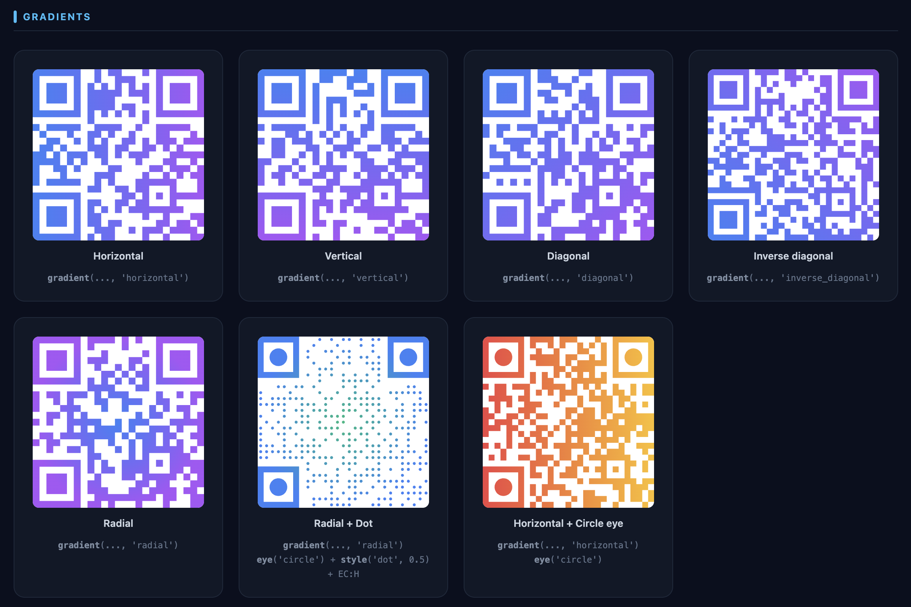

---

## Image Merging (Logo overlay)

Requires PNG format and `ErrorCorrection::High` (`H`) for reliable scanning.

```php
// From a file path
QrCode::format('png')
      ->errorCorrection('H')
      ->merge('/path/to/logo.png', 0.3)
      ->generate('https://devxi.com');

// From a string (e.g. fetched via HTTP)
QrCode::format('png')
      ->errorCorrection('H')
      ->mergeString(file_get_contents('/path/to/logo.png'), 0.3)
      ->generate('https://devxi.com');
```

The second argument is the percentage of the QR code the image should occupy (default `0.2`).

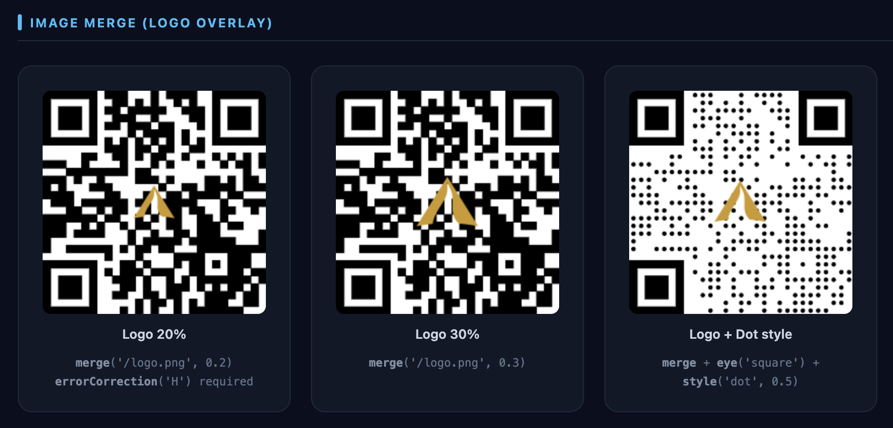

---

## Data URI (`toDataUri`)

Generates a base64-encoded data URI — ideal for embedding QR codes in emails, PDFs, or anywhere external URLs are unavailable.

```php
$uri = QrCode::size(200)->toDataUri('https://devxi.com');
// → "data:image/svg+xml;base64,..."

// PNG
$uri = QrCode::size(200)->format('png')->toDataUri('https://devxi.com');
// → "data:image/png;base64,..."
```

In Blade:

```blade
toDataUri('https://devxi.com') }}" alt="QR Code">
```

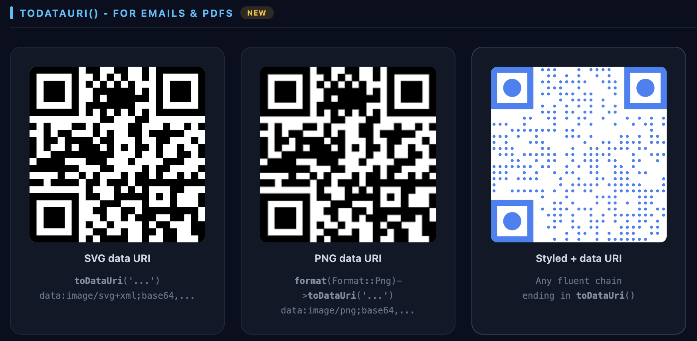

---

## Blade Directive

A `@qrcode` directive is registered automatically.

```blade
{{-- Uses config defaults for format and size --}}
@qrcode('https://devxi.com')

{{-- Override format and size per call --}}
@qrcode('https://devxi.com', 'svg', 200)

{{-- Using enums --}}
@php use Devxisas\QrStudio\Enums\Format; @endphp
@qrcode('https://devxi.com', Format::Png, 300)
```

When no `format` argument is passed, the directive reads `qr-studio.format` from config (default `svg`). When no `size` argument is passed, the `` width/height uses `qr-studio.size` from config.

SVG output is echoed directly as HTML. PNG and EPS output is wrapped in an `` tag automatically so no raw binary reaches the browser.

---

## Response Macro

Stream a QR code directly as an HTTP response with the correct `Content-Type` header.

```php
// Uses config defaults for format and size
return response()->qrcode('https://devxi.com');

// Override format and size per call
return response()->qrcode('https://devxi.com', 'png', 300);

// Using enum
use Devxisas\QrStudio\Enums\Format;
return response()->qrcode('https://devxi.com', Format::Png, 300);
```

When `size` is not passed, the macro uses `qr-studio.size` from config. The `X-Content-Type-Options: nosniff` header is always set automatically.

```php
// Route example
Route::get('/qr/{url}', fn (string $url) => response()->qrcode($url, 'png'));
```

---

## Artisan Command

Generate QR codes from the command line.

```bash
# Print SVG to stdout
php artisan qrcode:generate "https://devxi.com"

# Save PNG to a file
php artisan qrcode:generate "https://devxi.com" --format=png --output=public/qr.png

# All options
php artisan qrcode:generate "https://devxi.com" \
    --format=svg \
    --size=300 \
    --margin=2 \
    --error-correction=H \
    --output=/path/to/output.svg
```

| Option               | Default | Values             |
|----------------------|---------|--------------------|
| `--format`           | `svg`   | `svg`, `eps`, `png`|
| `--size`             | `200`   | 1–4096             |
| `--margin`           | `0`     | integer            |
| `--error-correction` | `M`     | `L`, `M`, `Q`, `H` |
| `--output`           | stdout  | file path          |

---

## Data Types

All data types return an `HtmlString` just like `generate()` and follow the same fluent interface.

### URL / Plain text

```php
QrCode::generate('https://devxi.com');
QrCode::generate('Plain text content');
```

### Email

```php
QrCode::email('hello@example.com', 'Subject', 'Body text');
```

### Phone number

```php
QrCode::phoneNumber('+50312345678');
```

### SMS

```php
QrCode::sms('+50312345678', 'Message body');
```

### Geo location

```php
QrCode::geo(13.6929, -89.2182);  // latitude, longitude
```

### WiFi

```php
QrCode::wifi([
    'encryption' => 'WPA',       // WPA | WEP | nopass
    'ssid'       => 'NetworkName',
    'password'   => 'secret123',
    'hidden'     => false,        // optional
]);
```

### Bitcoin

```php
QrCode::btc('1A1zP1eP5QGefi2DMPTfTL5SLmv7Divf', '0.001', [
    'label'         => 'Donation',   // optional
    'message'       => 'Thank you',  // optional
    'returnAddress' => 'bc1q...',    // optional
]);
```

### vCard 3.0

```php
QrCode::errorCorrection('H')->vCard([
    'name'    => 'Sorto;Elmer',   // LastName;FirstName
    'email'   => 'elmer@devxi.com',
    'phone'   => '+50312345678',
    'org'     => 'Devxisas',
    'title'   => 'Developer',
    'url'     => 'https://devxi.com',
    'address' => 'San Salvador, El Salvador',  // optional
    'note'    => 'Some note',                   // optional
]);
```

### MeCard (iOS / Android)

```php
QrCode::meCard([
    'name'    => 'Sorto,Elmer',
    'phone'   => '+50312345678',
    'email'   => 'elmer@devxi.com',
    'url'     => 'https://devxi.com',
    'address' => 'San Salvador',   // optional
    'note'    => 'Some note',      // optional
]);
```

### Calendar Event (iCal)

Accepts ISO 8601 strings, Unix timestamps, or any `DateTimeInterface`.

```php
QrCode::calendarEvent([
    'summary'     => 'Laravel Meetup SV',
    'start'       => '2025-06-15 18:00:00',
    'end'         => '2025-06-15 20:00:00',
    'location'    => 'San Salvador, El Salvador',  // optional
    'description' => 'Monthly Laravel meetup',      // optional
    'url'         => 'https://devxi.com',            // optional
]);

// With Carbon / DateTimeInterface
QrCode::calendarEvent([
    'summary' => 'Meeting',
    'start'   => now()->addDay(),
    'end'     => now()->addDay()->addHours(2),
]);
```

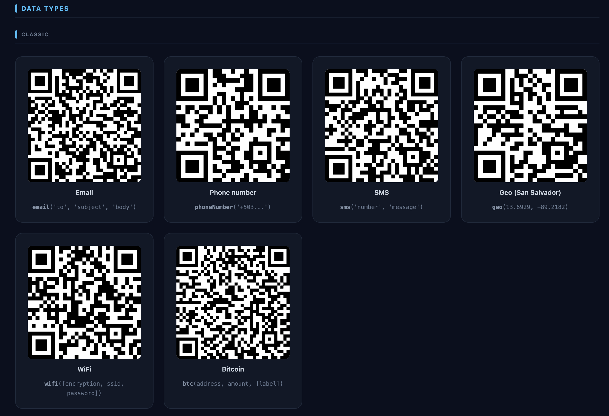

---

## HasQrCode Trait

Add QR code generation directly to any Eloquent model. The trait is flexible: return a plain string for URL / text QR codes, or return an array and override `qrCodeType()` for structured data types (MeCard, vCard, WiFi, etc.).

### URL / plain-text model

```php
use Devxisas\QrStudio\Traits\HasQrCode;

class Product extends Model
{
    use HasQrCode;

    public function qrCodeData(): string
    {
        return route('products.show', $this);
    }
}

// In controllers or Blade:
$product->qrCodeSvg();          // inline SVG (uses size from config)
$product->qrCodeSvg(300);       // 300 px SVG
$product->qrCodeDataUri();      // PNG data URI for 
$product->qrCodeDataUri(300);   // PNG at 300 px
```

In Blade:

```blade
{!! $product->qrCodeSvg() !!}
qrCodeDataUri(200) }}" alt="Product QR">
```

### Structured data types

Return an array from `qrCodeData()` and override `qrCodeType()` to match the generator's data type method:

```php
use Devxisas\QrStudio\Traits\HasQrCode;

// Contact card — encodes a MeCard QR code
class Contact extends Model
{
    use HasQrCode;

    public function qrCodeType(): string { return 'meCard'; }

    public function qrCodeData(): array
    {
        return [
            'name'  => $this->last_name . ',' . $this->first_name,
            'email' => $this->email,
            'phone' => $this->phone ?? '',
            'url'   => route('contacts.show', $this),
        ];
    }
}

// Office / venue — encodes a WiFi QR code
class Office extends Model
{
    use HasQrCode;

    public function qrCodeType(): string { return 'wifi'; }

    public function qrCodeData(): array
    {
        return [
            'encryption' => 'WPA',
            'ssid'       => $this->wifi_ssid,
            'password'   => $this->wifi_password,
        ];
    }
}

// User profile — encodes a vCard QR code
class User extends Model
{
    use HasQrCode;

    public function qrCodeType(): string { return 'vCard'; }

    public function qrCodeData(): array
    {
        return [
            'name'  => $this->last_name . ';' . $this->first_name,
            'email' => $this->email,
            'phone' => $this->phone ?? '',
            'url'   => route('users.show', $this),
        ];
    }
}
```

Supported `qrCodeType()` return values (must match a generator magic method):

| Value           | Data type            |
|-----------------|----------------------|
| `meCard`        | MeCard (iOS/Android) |
| `vCard`         | vCard 3.0            |
| `wifi`          | WiFi network         |
| `email`         | Email with subject/body |
| `phoneNumber`   | Phone number         |
| `sMS`           | SMS with body        |
| `geo`           | GPS coordinates      |
| `bTC`           | Bitcoin payment      |
| `calendarEvent` | iCal event           |

### Trait API

| Method            | Signature                                                      | Description                                                                         |
|-------------------|----------------------------------------------------------------|-------------------------------------------------------------------------------------|
| `qrCodeData()`    | `qrCodeData(): string\|array`                                  | **Must be implemented.** Return a string for URL/text, or an array for structured types. Throws `BadMethodCallException` if not overridden. |
| `qrCodeType()`    | `qrCodeType(): string`                                         | Override to set the data type when returning an array from `qrCodeData()`. Default: `'text'`. |
| `qrCodeSvg()`     | `qrCodeSvg(int $size = 0): string`                             | Returns an inline SVG string. `$size = 0` uses the package config default.          |
| `qrCodeDataUri()` | `qrCodeDataUri(int $size = 0, Format $format = Format::Png): string` | Returns a base64 data URI. Defaults to PNG.                                   |

---

## Combining Options

Options are fully composable via fluent chaining:

```php
QrCode::size(250)
      ->format('png')
      ->style('dot', 0.5)
      ->eye('circle')
      ->gradient(59, 130, 246, 99, 102, 241, 'radial')
      ->errorCorrection('H')
      ->generate('https://devxi.com');
```

```php
QrCode::size(250)
      ->style('round', 0.7)
      ->eye('square')
      ->color(16, 185, 129)
      ->backgroundColor(15, 23, 42)
      ->margin(2)
      ->generate('https://devxi.com');
```


---

## API Reference

Complete reference for all public methods on `QrCodeGenerator` (accessed via the `QrCode` facade).

### generate()

**Signature:** `generate(string $text, ?string $filename = null): HtmlString|string|null`

**Description:** Generates the QR code for the given text. When `$filename` is provided the output is written to that path and `null` is returned. Without a filename, an `HtmlString` is returned (or a plain `string` outside of Laravel). Calls `reset()` automatically after execution, so all per-call options are cleared.

**Parameters:**

| Name        | Type      | Required | Description                                      |
|-------------|-----------|----------|--------------------------------------------------|
| `$text`     | `string`  | Yes      | The content to encode in the QR code             |
| `$filename` | `?string` | No       | Absolute path to write the output file           |

**Exceptions:** `WriterException` if the underlying BaconQrCode writer fails.

**Example:**

```php
// Returns HtmlString — embed directly in Blade
$svg = QrCode::size(200)->generate('https://devxi.com');

// Write to file — returns null
QrCode::format('png')->size(300)->generate('https://devxi.com', '/var/www/qr.png');
```

---

### toDataUri()

**Signature:** `toDataUri(string $text): string`

**Description:** Generates the QR code and returns a base64-encoded data URI. Ideal for embedding in emails, PDFs, or any context where external URLs are blocked. Calls `reset()` automatically after execution.

- SVG format returns `data:image/svg+xml;base64,...`
- PNG format returns `data:image/png;base64,...`

**Parameters:**

| Name    | Type     | Required | Description             |
|---------|----------|----------|-------------------------|
| `$text` | `string` | Yes      | The content to encode   |

**Exceptions:** `WriterException` if the underlying writer fails.

**Example:**

```php
$uri = QrCode::size(200)->toDataUri('https://devxi.com');
// → "data:image/svg+xml;base64,..."

// In Blade
format('png')->toDataUri('https://devxi.com') }}" alt="QR">
```

---

### format()

**Signature:** `format(Format|string $format): static`

**Description:** Sets the output format. Accepts a `Format` enum (recommended) or the strings `'svg'`, `'eps'`, or `'png'`.

**Parameters:**

| Name      | Type               | Required | Description                        |
|-----------|--------------------|----------|------------------------------------|
| `$format` | `Format\|string`   | Yes      | Output format: `svg`, `eps`, `png` |

**Exceptions:** `InvalidArgumentException` if a string other than `svg`, `eps`, or `png` is passed.

**Example:**

```php
QrCode::format('png')->generate('...');
QrCode::format(Format::Png)->generate('...');
```

---

### size()

**Signature:** `size(int $pixels): static`

**Description:** Sets the width and height of the generated QR code in pixels. Minimum value is 1.

**Parameters:**

| Name      | Type  | Required | Description                      |
|-----------|-------|----------|----------------------------------|
| `$pixels` | `int` | Yes      | Size in pixels (minimum: 1)      |

**Exceptions:** `InvalidArgumentException` if `$pixels` is less than 1.

**Example:**

```php
QrCode::size(300)->generate('...');
```

---

### margin()

**Signature:** `margin(int $margin): static`

**Description:** Sets the quiet zone (whitespace border) around the QR code. Minimum value is 0.

**Parameters:**

| Name      | Type  | Required | Description                        |
|-----------|-------|----------|------------------------------------|
| `$margin` | `int` | Yes      | Quiet zone width in pixels (min 0) |

**Exceptions:** `InvalidArgumentException` if `$margin` is negative.

**Example:**

```php
QrCode::size(300)->margin(4)->generate('...');
```

---

### encoding()

**Signature:** `encoding(string $encoding): static`

**Description:** Sets the character encoding used when encoding the text. The value is converted to uppercase internally. Defaults to `UTF-8`.

**Parameters:**

| Name        | Type     | Required | Description                       |
|-------------|----------|----------|-----------------------------------|
| `$encoding` | `string` | Yes      | Character encoding (e.g. `UTF-8`) |

**Example:**

```php
QrCode::encoding('ISO-8859-1')->generate('...');
```

---

### errorCorrection()

**Signature:** `errorCorrection(ErrorCorrection|string $errorCorrection): static`

**Description:** Sets the error correction level. Higher levels allow the code to be read even when partially obscured (e.g. with a logo). Accepts an `ErrorCorrection` enum or the strings `'L'`, `'M'`, `'Q'`, `'H'`.

**Parameters:**

| Name               | Type                        | Required | Description                          |
|--------------------|-----------------------------|----------|--------------------------------------|
| `$errorCorrection` | `ErrorCorrection\|string`   | Yes      | Error correction level: L, M, Q or H |

**Exceptions:** `InvalidArgumentException` if a string other than `L`, `M`, `Q`, or `H` is passed.

**Example:**

```php
QrCode::errorCorrection('H')->generate('...');
QrCode::errorCorrection(ErrorCorrection::High)->generate('...');
```

---

### style()

**Signature:** `style(Style|string $style, float $size = 0.5): static`

**Description:** Sets the module (dot) rendering style. Accepts a `Style` enum or the strings `'square'`, `'dot'`, or `'round'`. The `$size` parameter controls the fill ratio of each module and must be strictly between 0 and 1.

> **Important:** `dot` and `round` styles render all pixels as dots, including the three finder-pattern eyes. Without an explicit `eye()` call the finder squares disappear and scanners fail to orient the code. Always combine `style('dot', ...)` or `style('round', ...)` with `->eye('square')` or `->eye('circle')`.

**Parameters:**

| Name     | Type             | Required | Description                                     |
|----------|------------------|----------|-------------------------------------------------|
| `$style` | `Style\|string`  | Yes      | Module style: `square`, `dot`, or `round`       |
| `$size`  | `float`          | No       | Fill ratio, must be > 0 and < 1. Default: `0.5` |

**Exceptions:** `InvalidArgumentException` if an invalid style string is passed, or if `$size` is `>= 1` or `<= 0`.

**Example:**

```php
// Correct — always include eye() with dot/round
QrCode::style('dot', 0.5)->eye('square')->errorCorrection('H')->generate('...');

// Wrong — finder eyes will be invisible, code will not scan
QrCode::style('dot', 0.5)->generate('...');
```

---

### eye()

**Signature:** `eye(EyeStyle|string $style): static`

**Description:** Sets the finder-eye (corner square) rendering style. Accepts an `EyeStyle` enum or the strings `'square'`, `'circle'`, or `'pointy'`.

> **Required when using `style('dot')` or `style('round')`** to ensure the finder pattern remains recognizable to scanners.

**Parameters:**

| Name     | Type                  | Required | Description                                     |
|----------|-----------------------|----------|-------------------------------------------------|
| `$style` | `EyeStyle\|string`    | Yes      | Eye style: `square`, `circle`, or `pointy`      |

**Exceptions:** `InvalidArgumentException` if a string other than `square`, `circle`, or `pointy` is passed.

**Example:**

```php
QrCode::eye('circle')->generate('...');
QrCode::eye(EyeStyle::Pointy)->generate('...');

// Required with dot/round modules
QrCode::style('dot', 0.5)->eye('square')->errorCorrection('H')->generate('...');
```

---

### color()

**Signature:** `color(int $red, int $green, int $blue, ?int $alpha = null): static`

**Description:** Sets the foreground color of the QR code modules. Alpha channel is optional: `0` = fully opaque, `127` = fully transparent.

**Parameters:**

| Name     | Type   | Required | Description                          |
|----------|--------|----------|--------------------------------------|
| `$red`   | `int`  | Yes      | Red channel (0–255)                  |
| `$green` | `int`  | Yes      | Green channel (0–255)                |
| `$blue`  | `int`  | Yes      | Blue channel (0–255)                 |
| `$alpha` | `?int` | No       | Alpha (0 = opaque, 127 = transparent)|

**Example:**

```php
QrCode::color(59, 130, 246)->generate('...');
QrCode::color(59, 130, 246, 50)->generate('...');  // semi-transparent
```

---

### backgroundColor()

**Signature:** `backgroundColor(int $red, int $green, int $blue, ?int $alpha = null): static`

**Description:** Sets the background color of the QR code. Alpha channel follows the same convention as `color()`: `0` = fully opaque, `127` = fully transparent.

**Parameters:**

| Name     | Type   | Required | Description                          |
|----------|--------|----------|--------------------------------------|
| `$red`   | `int`  | Yes      | Red channel (0–255)                  |
| `$green` | `int`  | Yes      | Green channel (0–255)                |
| `$blue`  | `int`  | Yes      | Blue channel (0–255)                 |
| `$alpha` | `?int` | No       | Alpha (0 = opaque, 127 = transparent)|

**Example:**

```php
QrCode::color(255, 255, 255)->backgroundColor(15, 23, 42)->generate('...');
```

---

### eyeColor()

**Signature:** `eyeColor(int $eyeNumber, int $innerRed, int $innerGreen, int $innerBlue, int $outerRed = 0, int $outerGreen = 0, int $outerBlue = 0): static`

**Description:** Sets the color of one of the three finder eyes independently. `$eyeNumber` is `0`, `1`, or `2`. Each eye has an inner color (the center dot) and an outer color (the surrounding frame). When only inner colors are provided, outer defaults to black (`0, 0, 0`).

**Parameters:**

| Name          | Type  | Required | Description                             |
|---------------|-------|----------|-----------------------------------------|
| `$eyeNumber`  | `int` | Yes      | Eye index: 0, 1, or 2                   |
| `$innerRed`   | `int` | Yes      | Inner dot red channel (0–255)           |
| `$innerGreen` | `int` | Yes      | Inner dot green channel (0–255)         |
| `$innerBlue`  | `int` | Yes      | Inner dot blue channel (0–255)          |
| `$outerRed`   | `int` | No       | Outer frame red channel. Default: `0`   |
| `$outerGreen` | `int` | No       | Outer frame green channel. Default: `0` |
| `$outerBlue`  | `int` | No       | Outer frame blue channel. Default: `0`  |

**Exceptions:** `InvalidArgumentException` if `$eyeNumber` is not 0, 1, or 2.

**Example:**

```php
QrCode::eyeColor(0, 239, 68, 68)           // eye 0 — red inner, black outer
      ->eyeColor(1, 34, 197, 94)           // eye 1 — green inner, black outer
      ->eyeColor(2, 59, 130, 246)          // eye 2 — blue inner, black outer
      ->generate('...');

// Separate inner and outer colors
QrCode::eyeColor(0, 255, 255, 255, 59, 130, 246)->generate('...');
```

---

### gradient()

**Signature:** `gradient(int $startR, int $startG, int $startB, int $endR, int $endG, int $endB, GradientType|string $type): static`

**Description:** Applies a gradient fill to the QR code foreground modules. The gradient runs from the start color to the end color according to the specified type. Only works with SVG format or PNG with `ext-imagick` installed. Passing a `GradientType` enum is recommended; strings are accepted for compatibility.

**Parameters:**

| Name      | Type                       | Required | Description                                         |
|-----------|----------------------------|----------|-----------------------------------------------------|
| `$startR` | `int`                      | Yes      | Start color red channel (0–255)                     |
| `$startG` | `int`                      | Yes      | Start color green channel (0–255)                   |
| `$startB` | `int`                      | Yes      | Start color blue channel (0–255)                    |
| `$endR`   | `int`                      | Yes      | End color red channel (0–255)                       |
| `$endG`   | `int`                      | Yes      | End color green channel (0–255)                     |
| `$endB`   | `int`                      | Yes      | End color blue channel (0–255)                      |
| `$type`   | `GradientType\|string`     | Yes      | Gradient direction/shape (see Enum Reference below) |

**Exceptions:** `InvalidArgumentException` if an invalid gradient type string is passed. `RuntimeException` at render time if PNG format is used without `ext-imagick`.

**Example:**

```php
QrCode::gradient(59, 130, 246, 168, 85, 247, 'radial')->generate('...');
QrCode::gradient(59, 130, 246, 168, 85, 247, GradientType::Radial)->generate('...');
```

---

### merge()

**Signature:** `merge(string $filepath, float $percentage = 0.2, bool $absolute = false): static`

**Description:** Overlays an image (e.g. a logo) centered over the QR code. Only applies when using PNG format — silently has no effect for SVG or EPS. `$percentage` is the fraction of the QR code's width that the image should occupy (0.0–1.0). When `$absolute` is `false` and `$filepath` does not start with `/`, the path is prepended with `base_path()`. Use `errorCorrection('H')` to ensure the code remains scannable after the overlay.

**Parameters:**

| Name          | Type     | Required | Description                                            |
|---------------|----------|----------|--------------------------------------------------------|
| `$filepath`   | `string` | Yes      | Path to the image file                                 |
| `$percentage` | `float`  | No       | Logo size as fraction of QR width. Default: `0.2`      |
| `$absolute`   | `bool`   | No       | If `true`, skip `base_path()` prepending. Default: `false` |

**Exceptions:** `InvalidArgumentException` if the file cannot be read.

**Example:**

```php
QrCode::format('png')
      ->errorCorrection('H')
      ->merge('/path/to/logo.png', 0.25)
      ->generate('https://devxi.com');
```

---

### mergeString()

**Signature:** `mergeString(string $content, float $percentage = 0.2): static`

**Description:** Same as `merge()` but accepts the raw binary content of the image directly instead of a file path. Useful when the image has already been loaded into memory (e.g. fetched via HTTP). Only applies when using PNG format.

**Parameters:**

| Name          | Type     | Required | Description                                         |
|---------------|----------|----------|-----------------------------------------------------|
| `$content`    | `string` | Yes      | Binary image content                                |
| `$percentage` | `float`  | No       | Logo size as fraction of QR width. Default: `0.2`   |

**Example:**

```php
QrCode::format('png')
      ->errorCorrection('H')
      ->mergeString(file_get_contents('/path/to/logo.png'), 0.25)
      ->generate('https://devxi.com');
```

---

## Limitations & Known Issues

### 1. Dot/Round style without eye() — code will not scan

`DotsModule` and `RoundnessModule` in BaconQrCode render every pixel as a dot, including the three finder-pattern eyes. Without those recognizable squares, scanners cannot determine the orientation of the code and will fail to read it, even though the QR data is valid.

**Rule:** always call `->eye('square')` or `->eye('circle')` whenever you use `style('dot', ...)` or `style('round', ...)`.

```php
// Wrong — finder eyes are invisible, code will not scan
QrCode::style('dot', 0.5)->generate('...');

// Correct
QrCode::style('dot', 0.5)->eye('square')->errorCorrection('H')->generate('...');
```

---

### 2. PNG gradient without ext-imagick throws RuntimeException

Gradient rendering for PNG requires Imagick. When only GD is available (the fallback path), calling `->gradient()` before generating a PNG throws a `RuntimeException` at render time — not at configuration time.

**Solutions:**
- Install `ext-imagick` for full PNG gradient support.
- Use SVG format instead — gradients always work in SVG with no extra extension required.

```php
// Throws RuntimeException if Imagick is not installed:
QrCode::format('png')->gradient(59, 130, 246, 168, 85, 247, 'radial')->generate('...');

// Always works — use SVG when Imagick is unavailable:
QrCode::gradient(59, 130, 246, 168, 85, 247, 'radial')->generate('...');
```

---

### 3. merge() / mergeString() is PNG-only

Logo overlay is performed using bitmap compositing and silently has no effect when the output format is SVG or EPS. No error is thrown and no warning is emitted — the image just does not appear.

Always combine `merge()` with `format('png')` and `errorCorrection('H')` (H provides 30% redundancy, which compensates for the area covered by the logo).

```php
// Correct
QrCode::format('png')->errorCorrection('H')->merge('/logo.png', 0.25)->generate('...');

// Silent no-op — SVG output, logo ignored
QrCode::merge('/logo.png', 0.25)->generate('...');
```

---

### 4. Gradient without eyeColor() may produce low-contrast finder eyes

When `eyeColor()` is not set, finder eyes inherit the gradient fill. If the gradient produces a light color at the eye positions and the background is also light, the eye borders become invisible and scanners fail.

**Solution:** Use `eyeColor()` on all three eyes with high-contrast colors whenever using a gradient.

```php
QrCode::gradient(200, 220, 255, 240, 245, 255, 'radial')
      ->eyeColor(0, 10, 10, 80, 10, 10, 80)
      ->eyeColor(1, 10, 10, 80, 10, 10, 80)
      ->eyeColor(2, 10, 10, 80, 10, 10, 80)
      ->generate('...');
```

---

### 5. style() size must be strictly less than 1.0

The `$size` parameter in `style('dot', $size)` must be in the range `(0, 1)`. Passing `1.0` or any value `>= 1` throws an `InvalidArgumentException` immediately. Values close to `1.0` also produce nearly solid modules with no visible gap between them.

Recommended range: `0.5` to `0.7`.

```php
QrCode::style('dot', 1.0);  // throws InvalidArgumentException
QrCode::style('dot', 0.6);  // recommended
```

---

### 6. Low error correction with dot/round modules reduces scan reliability

Error correction levels L (7%) or M (15%) combined with dot or round modules often produce codes that real-world scanners refuse. The reduced per-module fill area leaves very little redundancy to compensate for noise, printing imperfections, or screen glare.

Always use `errorCorrection('H')` when using dot or round module styles.

```php
// Unreliable — default EC is M
QrCode::style('dot', 0.5)->eye('square')->generate('...');

// Reliable
QrCode::style('dot', 0.5)->eye('square')->errorCorrection('H')->generate('...');
```

---

### 7. EPS format has no browser preview

EPS (Encapsulated PostScript) is a valid vector format understood by print software (Illustrator, InDesign, macOS Preview), but browsers cannot render it inline. Using an EPS data URI in an `` tag will display nothing.

EPS is intended for print pipelines. Use `response()->qrcode('...', Format::Eps)` to stream it from a route, or write it to a file with `generate($text, $path)`. For web display, use SVG.

---

### 8. State resets automatically after generate() and toDataUri()

Every call to `generate()` or `toDataUri()` triggers an internal `reset()`, clearing all per-call options (format, size, style, colors, etc.) and returning the instance to config defaults. Do not split configuration across multiple statements expecting state to persist:

```php
// Wrong — state is reset after first generate(), second call uses defaults only
QrCode::size(300)->format('png');
QrCode::generate('...');

// Correct — configure everything in a single fluent chain
QrCode::size(300)->format('png')->generate('...');
```

---

## Enum Reference

All enums are backed enums so they work alongside their string equivalents.

```php
use Devxisas\QrStudio\Enums\Format;
use Devxisas\QrStudio\Enums\Style;
use Devxisas\QrStudio\Enums\EyeStyle;
use Devxisas\QrStudio\Enums\ErrorCorrection;
use Devxisas\QrStudio\Enums\GradientType;

Format::Svg          // 'svg'
Format::Eps          // 'eps'
Format::Png          // 'png'

Style::Square        // 'square'
Style::Dot           // 'dot'
Style::Round         // 'round'

EyeStyle::Square     // 'square'
EyeStyle::Circle     // 'circle'
EyeStyle::Pointy     // 'pointy'  — curved outer corner + circle inner (BaconQrCode 3.x)

ErrorCorrection::Low       // 'L'
ErrorCorrection::Medium    // 'M'
ErrorCorrection::Quartile  // 'Q'
ErrorCorrection::High      // 'H'

GradientType::Horizontal       // 'horizontal'
GradientType::Vertical         // 'vertical'
GradientType::Diagonal         // 'diagonal'
GradientType::InverseDiagonal  // 'inverse_diagonal'
GradientType::Radial           // 'radial'
```

---

## Testing

```bash
composer test           # all tests
composer test:unit      # unit tests only
composer analyse        # PHPStan static analysis
composer format         # Pint code style fix
composer format:check   # Pint check only
```

---

## Migrating from `simplesoftwareio/simple-qrcode`

This package was built as a modernized continuation of `simple-qrcode`. The core fluent API is identical, so most projects require only minor changes.

### Installation

```bash
composer remove simplesoftwareio/simple-qrcode
composer require devxisas/qr-studio
```

### Facade

```php
// Before
use SimpleSoftwareIO\QrCode\Facades\QrCode;

// After
use Devxisas\QrStudio\Facades\QrCode;
```

That's usually the only change needed. All existing method calls (`generate`, `size`, `format`, `color`, `style`, `eye`, `gradient`, `merge`, etc.) work identically.

### What's new

| Feature | simple-qrcode | qr-studio |
|---------|:---:|:---:|
| PHP 8.2+ strict types | — | ✓ |
| Backed enums for all options | — | ✓ |
| `toDataUri()` | — | ✓ |
| vCard 3.0 data type | — | ✓ |
| MeCard data type | — | ✓ |
| Calendar Event data type | — | ✓ |
| `@qrcode` Blade directive | — | ✓ |
| `response()->qrcode()` macro | — | ✓ |
| Artisan `qrcode:generate` command | — | ✓ |
| Publishable config file | — | ✓ |
| `HasQrCode` Eloquent trait | — | ✓ |
| Automatic state reset after `generate()` | — | ✓ |
| `EyeStyle::Pointy` (BaconQrCode 3.x) | — | ✓ |
| PNG via `ext-gd` fallback (no Imagick needed) | — | ✓ |
| Laravel 11 / 12 support | ✓ | ✓ |
| SVG / EPS / PNG formats | ✓ | ✓ |
| Image merging (logo overlay) | ✓ | ✓ |
| Colors, gradients, eye colors | ✓ | ✓ |
| Email, Phone, SMS, Geo, WiFi, BTC | ✓ | ✓ |

---

## Changelog

See [CHANGELOG.md](CHANGELOG.md).

## Contributing

See [CONTRIBUTING.md](CONTRIBUTING.md).

## Security

See [SECURITY.md](SECURITY.md).

## License

MIT — see [LICENSE](LICENSE).
